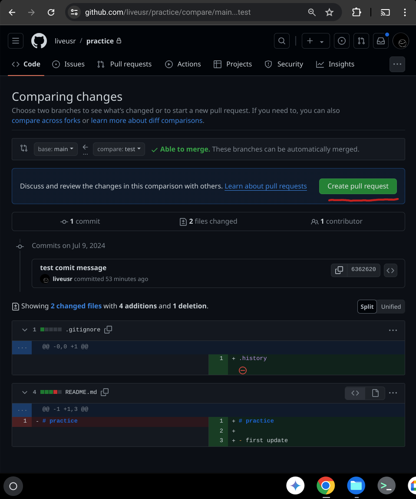

# How to use *VS Code* and *GitHub* together

* [Install **Local History** extension in *VS Code*](#install-local-history-extension-in-vs-code)
* [Setup **Password-less Auth** for *GitHub*](#setup-password-less-auth-for-github)
* [Configure your Git username and email](#configure-your-git-username-and-email)
* [Create a **new repository** on *GitHub*](#create-a-new-repository-on-github)
* [**Clone** a repository in *VS Code*](#clone-a-repository-in-vs-code)
* [Create a **new branch** in *VS Code*](#create-a-new-branch-in-vs-code)
* [Modify an existing file in *VS Code*](#modify-an-existing-file-in-vs-code)
* [Create a local **commit** in *VS Code*](#create-a-local-commit-in-vs-code)
* [Add a new file in *VS Code*](#add-a-new-file-in-vs-code)
* [Update (**amend**) an existing local commit in *VS Code*](#update-amend-an-existing-local-commit-in-vs-code)
* [Upload (**push**) local commits to the *remote* from *VS Code*](#upload-push-local-commits-to-the-remote-from-vs-code)
* [Create a **Pull Request** and add a reviewer from *GitHub*](#create-a-pull-request-and-add-a-reviewer-from-github)
* [Respond to review comments and update the Pull Request](#respond-to-review-comments-and-update-the-pull-request)
* [Close the review and **merge** Pull Request to the *main* branch](#close-the-review-and-merge-pull-request-to-the-main-branch)


--------------------------------------------------------------------------------

## Install [Local History](https://marketplace.visualstudio.com/items?itemName=xyz.local-history) extension in *VS Code*

Before we start with Git, let's install the [Local History](https://marketplace.visualstudio.com/items?itemName=xyz.local-history) extension in *VS Code*. This extension acts as a safety net!

**Do we really need it?** Probably, yes! It can help you out when you change or delete a file by accident. Every time you modify a file, a copy of the old contents is kept in the local history. At any time, you can compare a file with any older version from the history.

* Click on the `Extensions` option on the side panel and search for `Local History` extension:

    

* Install the `Local History` extension by developer `xyz`:

    

[<<< Home](#how-to-use-vs-code-and-github-together)

--------------------------------------------------------------------------------

## Setup Password-less Auth for *GitHub*

With SSH key authentication, you won't need to enter your username and password every time you interact with a Git repository. This can be a significant time-saver. Once you've set up your keys, you can clone, pull, push, and perform other Git operations without any interruptions for password prompts. Plus, it is considered more secure than passwords.

* **Generate an SSH Key**

    Open the Terminal and run:

    ```bash
    ssh-keygen -t ed25519 -C "your_email@example.com"
    ```

    or

    ```bash
    ssh-keygen -t rsa -b 4096 -C "your_email@example.com"
    ```

    When prompted *`Enter a file in which to save the key`*, press **`Enter`** to accept the default file location.

    When prompted *`Enter passphrase (empty for no passphrase)`*, press **`Enter`** for no passphrase.


* **Copy the Generated Public Key to *GitHub***

    To see the public key, run:

    ```bash
    cat ~/.ssh/id_ed25519.pub
    ```

    Copy the above key.

    Log in to your *GitHub* account and go to `Settings` **->** `SSH and GPG keys`, click on `New SSH key` and paste the above key.


* **Confirm the access with your *GitHub***

    Open the Terminal and run:

    ```bash
    ssh -T git@github.com
    ```

    It will ask for confirmation. Confirm it. And that’s it, and we are done.

[<<< Home](#how-to-use-vs-code-and-github-together)

--------------------------------------------------------------------------------

## Configure your Git username and email

Configure the user information associated with your Git commits. The name and email will be visible in any future commits you create and push to *GitHub*. *(NOTE: if you want to keep this configuration local to a single repository, run the following commands in the Git project directory without the `--global` option.)*

* **Configure Git `user.name`:**
    ```bash
    git config --global user.name "your_username"
    ```

* **Configure Git `user.email`:**
    ```bash
    git config --global user.email "your_email@example.com"
    ```

[<<< Home](#how-to-use-vs-code-and-github-together)

--------------------------------------------------------------------------------

## Create a new repository on *GitHub*

* Click on **`New`** button under the `Repositories` tab:

    

* Enter `Repository name`, select `Private` for private repository, add `README` file and click the **`Create repository`** button:

    

* To add a collaborator, click on the `Settings` tab -> `Collaborators` -> click **`Add people`** button and enter the username of the person you want to add as a collaborator:

    

[<<< Home](#how-to-use-vs-code-and-github-together)

--------------------------------------------------------------------------------

## Clone a repository in *VS Code*
* Copy the project URL from *GitHub*: Click on the `Code` tab -> **`Code`** button -> `Local` tab -> `SSH` option and copy the URL by clicking the **`Copy`** button:

    

* Click on the **`Clone Repository`** button under the `Explorer` option on the side panel, paste the copied project URL and hit **`Enter`**. Select the location where you want to create your repository and finally open the cloned repository:

    

[<<< Home](#how-to-use-vs-code-and-github-together)

--------------------------------------------------------------------------------

## Create a new branch in *VS Code*

* Click on the `Source Control` option on the side panel -> three dots `...` on the upper right corner -> `Branch` -> `Create Branch`, enter the new branch name in the new dialog box and hit **`Enter`**:

    

[<<< Home](#how-to-use-vs-code-and-github-together)

--------------------------------------------------------------------------------

## Modify an existing file in *VS Code*

* Click on the `Explorer` option on the side panel -> click on the file you want to modify and make changes. Once the file is saved, you'll notice **`M`** (Modified) next to the file name in the `Explorer` panel:

    

[<<< Home](#how-to-use-vs-code-and-github-together)

--------------------------------------------------------------------------------

## Create a local commit in *VS Code*

* Click on the `Source Control` option on the side panel -> click on the `Stage Changes` option (**`+`** button) next to the modified file name -> enter commit message and hit the **`Commit`** button:

    

[<<< Home](#how-to-use-vs-code-and-github-together)

--------------------------------------------------------------------------------

## Add a new file in *VS Code*

* Click on the `Explorer` option on the side panel -> click on the `New File...` option (**`🗋`** button) next to the repository name -> enter the new file name in the text box (`.gitignore` in this case) and hit **`Enter`**:

    

* Add anything to the new file (in this example I'm adding `.history` to `.gitignore` so Git won't track the `.history` directory created by the [Local History](https://marketplace.visualstudio.com/items?itemName=xyz.local-history) extension). Once you save the file, you'll notice **`U`** (Untracked) next to the file name in the `Explorer` panel:

    

[<<< Home](#how-to-use-vs-code-and-github-together)

--------------------------------------------------------------------------------

## Update (amend) an existing local commit in *VS Code*

Sometimes you may need to modify the last commit message or make more changes, you can amend the last commit.

* Click on the `Source Control` option on the side panel -> click on the `Stage Changes` option (**`+`** button) next to the untracked file name -> click on the **`More Actions`** button () next to the **`Commit`** button and select `Commit (Amend)`  option:

    

* It will open a new editor window with the commit message. Update the commit message if you want and then hit **`Accept Commit Message`** button to complete the commit:

    

[<<< Home](#how-to-use-vs-code-and-github-together)

--------------------------------------------------------------------------------

## Upload (push) local commits to the *remote* from *VS Code*

* Once your local changes are committed and ready, you can upload them to *GitHub* by clicking on the **`Publish Branch`** button in the `Source Control` option on the side panel:

    

* You can see your changes are now visible under your branch (`test` in this case) on *GitHub*. Click on `Code` tab -> expand down-arrow next to `main` branch -> select your branch (`test` in this case):

    

* Once the branch is pushed for the first time, you need to use **`Sync Changes`** button to push the subsequent changes to *GitHub*:

    

[<<< Home](#how-to-use-vs-code-and-github-together)

--------------------------------------------------------------------------------

## Create a Pull Request and add a reviewer from *GitHub*

You can create a Pull Request to request merge to the `main` branch. You can also add reviewers and get feedback/approval on your changes before merging.

* To create a new Pull Request, click on the `Pull Requests` tab -> **`New Pull Request`** button:

    

* Select `base` branch as `main` branch and `compare` branch as your branch (`test` in this case):

    

* Once you select the branch, you'll see the diff between those two branches. This can include multiple commits. Click **`Create Pull Request`** button:

    

* Now you can add some description about changes if you wish, add reviewers using `Reviewers` option on the right and click **`Create Pull Request`** button to submit the Pull Request:

    

[<<< Home](#how-to-use-vs-code-and-github-together)

--------------------------------------------------------------------------------

## Respond to review comments and update the Pull Request

You can view all review comments from the `Pull Requests` tab on *GitHub* and respond to them. If you modify the code, commit it locally and push changes to *GitHub*. You can use the existing branch for making new changes. Use the following guides for reference:

* [Modify an existing file in *VS Code*](#modify-an-existing-file-in-vs-code)
* [Add a new file in *VS Code*](#add-a-new-file-in-vs-code)
* [Create a local **commit** in *VS Code*](#create-a-local-commit-in-vs-code)
* [Update (**amend**) an existing local commit in *VS Code*](#update-amend-an-existing-local-commit-in-vs-code)
* [Upload (**push**) local commits to the *remote* from *VS Code*](#upload-push-local-commits-to-the-remote-from-vs-code)

[<<< Home](#how-to-use-vs-code-and-github-together)

--------------------------------------------------------------------------------

## Close the review and merge Pull Request to the *main* branch

Once the review is done and the code looks good, you can merge it to the `main` branch.

* Go to `Pull Requests` tab click on the **`Merge pull request`** button for the open Pull Request:

    

* Add a commit message to describe what changes/commits are included in this merge and click the **`Confirm merge`** button:

    

After merging your changes, you can safely remove this branch from both *GitHub* and *VS Code*. You can keep using the same branch for future edits, but it's a good practice to create a new branch for new sets of changes.

[<<< Home](#how-to-use-vs-code-and-github-together)
